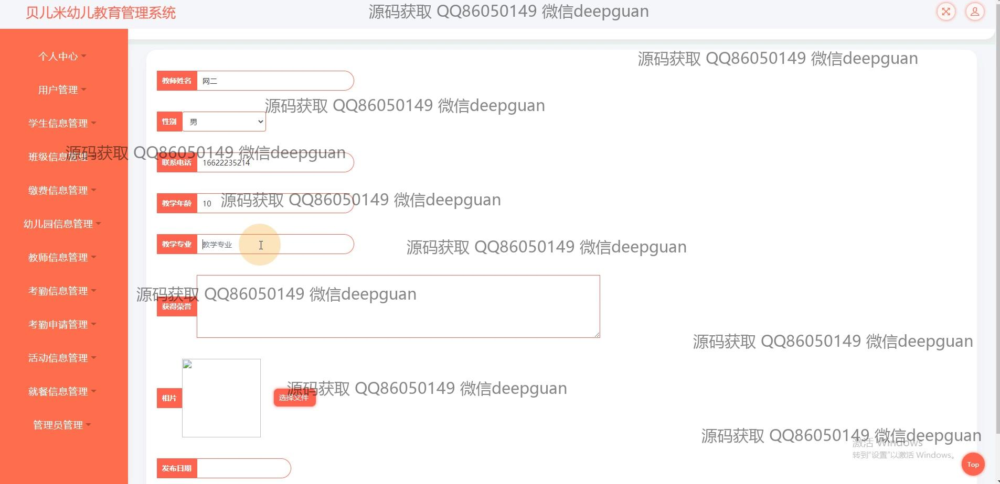

<h1 align="center">的幼儿园教育综合管理系统</h1>

## 简介
幼儿园教育综合管理系统：角色分为管理员、家长；支持用户注册、学生信息管理、班级管理、活动发布、考勤管理、教师信息录入及缴费信息管理等功能。    --计算机毕业设计源码；毕设源码；java毕业设计源码

## 联系方式

<h3 align="center">获取完整代码与数据库文件 + 微信：deepguan QQ: 86050149 QQ群: 783742310</h3>

<h3 align="center">可帮忙远程部署 包运行成功！提供远程部署、修改代码、设计文档指导、代码讲解等服务！</h3>

## 功能介绍（完整见运行截图）
管理员：基本功能包括登录、注册、退出和密码重置；用户管理模块可查询、添加、修改和删除用户信息；学生信息管理模块支持录入学生基本信息，包括学号、姓名、性别、班级和家长信息；班级管理模块可以编辑班级信息如班级名称和负责教师；教师信息管理模块支持教师个人信息和荣誉奖励的录入与管理；考勤信息管理模块可查看、查询、添加和批量删除考勤记录；活动管理模块可发布活动信息，包括名称、内容、地址和图片；缴费信息管理模块支持学生缴费记录的录入与查询。

教师：可以查看和管理自己的个人信息；负责维护班级信息，包括添加学生资料和管理活动；可查看和更新考勤记录；上传荣誉奖励资料并提交更新。

家长：注册时需提供个人信息，如手机号、密码、姓名、身份证号等；个人中心可修改信息并上传头像；可查看学生的考勤信息和缴费记录；参与活动管理模块的活动评论和点赞功能。

学生：无独立操作权限，但其信息可被管理者录入与更新；信息包括学号、姓名、性别、班级等；参与活动的信息记录由管理员负责管理和展示。

## 运行截图

本代码来源于网络,仅供学习参考使用!

